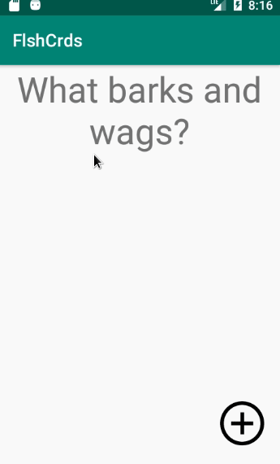

# FlshCrds
My flashcard app

### App Description
This app simulates a flashcard by hiding and showing the answer to a question.

## Week 4 Progress

### Walk-though
The FlshCrds app can now allow users to modify the contents of their flashcard.

See branch `w4_v1_required-features-only`.

 

### Required
- [X] User can click on a ‘+’ button that takes the user to new ‘Add Card Screen’
- [X] The 'Add Card Screen' has a cancel button to take the user back to the main screen
- [X] User can enter and submit a Question and Answer through the 'Add Card Screen'
- [X] User will see the card they just created on the main screen when they press the 'Save Button'

### Optional
- [ ] User can edit a card
- [ ] An error message is shown if the user doesn't enter both a Question and an Answer
- [ ] A notification is shown if the card was created successfully
- [ ] User can also enter multiple choice answers when creating a card
- [ ] App is further styled and customized!

## Week 2 Progress

### Walk-though

On branch `v1_answer-appears-bottom-of-question`:

Taping the question shows the answer on the bottom of the question asked.

 

On branch `v2_answer-appears-over-question`:

Taping the question toggles between showing the answer where the question once was.

 

On branch `v3_optional-requirements`:

Shows features implemented in the `Optional` section of this doc.

**Specicially**:
[X] Style the question and answer side of the card to better distinguish between the two sides

 

On branch `v4_question-with-multiple-choice`:

Shows features implemented in the `Optional` section of this doc. 

**Specicially**:
- [X] Add responsive multiple choice answers beneath the card
   - [X] Change the background color of the multiple choice answers when clicked to indicate if the question was answered correctly
- [X] Further customize and style the card

 

### Required
- [X] Create New Project in Android Studio
- [X] Add a view for the front side of the flashcard to display the question
- [X] Add a view for the back side of the flashcard to display the answer
- [X] Build in logic to show the answer side when the card is tapped
- [X] Push code to GitHub
### Optional
- [X] toggle the flashcard between the question side and the answer side
- [X] Style the question and answer side of the card to better distinguish between the two sides
- [X] Add responsive multiple choice answers beneath the card
   - [X] Change the background color of the multiple choice answers when clicked to indicate if the question was answered correctly
- [X] Further customize and style the card
